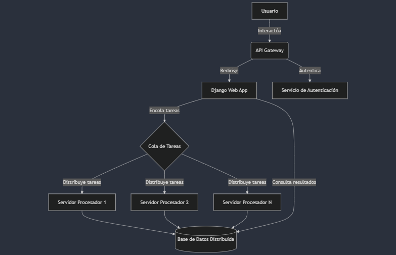

# Sistema de Procesamiento DICOM Distribuido

## Descripción General
Este proyecto implementa un sistema distribuido para procesar grandes lotes de imágenes médicas DICOM. El sistema está diseñado para manejar múltiples cargas concurrentes de imágenes, realizar procesamiento distribuido y permitir a los usuarios recuperar los resultados de manera eficiente.

## Arquitectura del Sistema

## Componentes Principales

1. **API Gateway**: 
   - Punto de entrada principal para todas las solicitudes.
   - Maneja autenticación, balanceo de carga y enrutamiento.
   - Implementado usando Kong o Amazon API Gateway.

2. **Django Web App**:
   - Maneja la lógica de negocio, autenticación de usuarios e interfaz web.
   - Utiliza Django REST Framework para APIs.

3. **Cola de Tareas**:
   - Implementada con Celery para la distribución de tareas de procesamiento.

4. **Servidores de Procesamiento**:
   - Múltiples servidores que procesan las imágenes DICOM.
   - Implementados como trabajadores de Celery.

5. **Base de Datos Distribuida**:
   - Almacena resultados de procesamiento y metadatos.
   - Utiliza PostgreSQL con replicación.

6. **Servicio de Autenticación**:
   - Maneja la autenticación y autorización de usuarios.
   - Implementado usando el sistema de autenticación integrado de Django.

## Características Principales

- Procesamiento distribuido de imágenes DICOM
- Escalabilidad horizontal para manejar grandes volúmenes de datos
- Interfaz web para carga de imágenes y visualización de resultados
- API RESTful para integración con otros sistemas
- Seguridad y cumplimiento con HIPAA y GDPR

## Tecnologías Utilizadas

- Django y Django REST Framework
- Celery para procesamiento asíncrono
- PostgreSQL para almacenamiento de datos
- Kong o Amazon API Gateway
- Docker para containerización (opcional)
